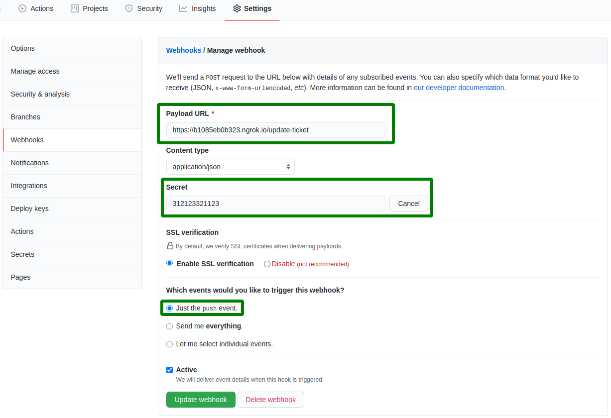

# Github to asana connector

### development

```shell script
$ yarn
$ yarn dev
```

### production

```shell script
$ yarn
$ yarn build
```

### configs
* [Here](https://app.asana.com/0/developer-console) generate a new app key and put it to `personalAccessToken` in the code
* Set a project ID to `projectId` constant in the code
* Create a new GitHub webhook for each repository (green is important fields) 

### docs
* [Github hook payload](https://docs.github.com/en/developers/webhooks-and-events/webhooks/webhook-events-and-payloads)
* [Asana node sdk](https://developers.asana.com/docs/node-hello-world)
* [Vercel's micro](https://github.com/vercel/micro)
